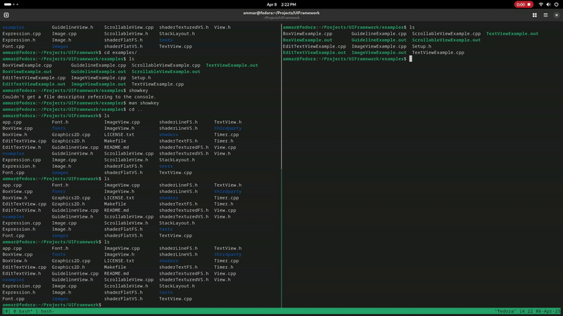
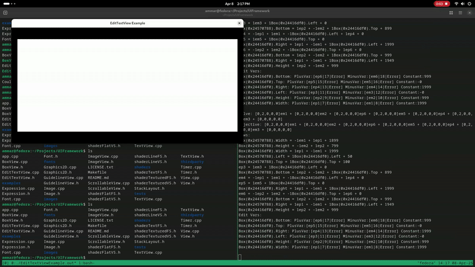
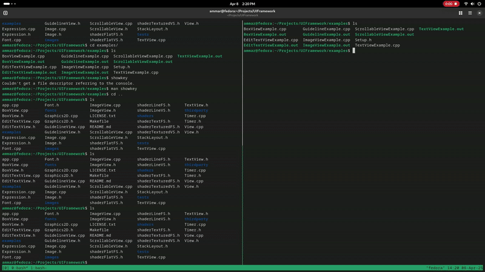
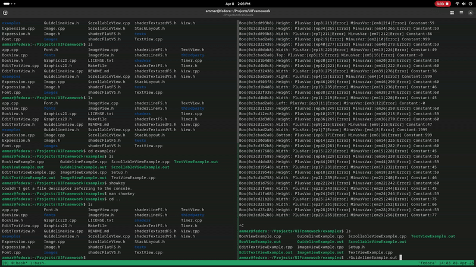
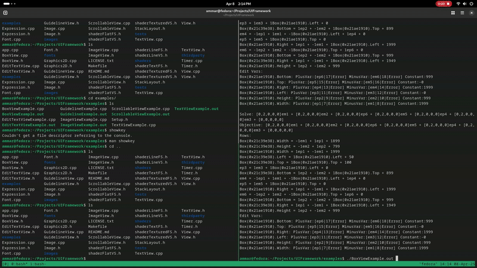

# UI Framework

## A small UI framework written in C++
- Features a Hierarchical Constraint-Based Layout System based on the [Cassowary algorithm](https://constraints.cs.washington.edu/solvers/cassowary-tochi.pdf)
- Written using Vulkan, FreeType, GLFW, and STB
- Current Widgets includes:
  - TextView
  - EditTextView
  - ImageView
  - ScrollableView
  - Guideline "Views" (Used for draggable widgets)
  - BoxView

### Widget Examples
Sample applications are within [examples](examples/) directory.

**TextView**\

---
**EditTextView**\

---
**ImageView**\

---
**ScrollableView**\

---
**Guideline**\

---
**BoxView**\

---
**Sample Application**\

--
